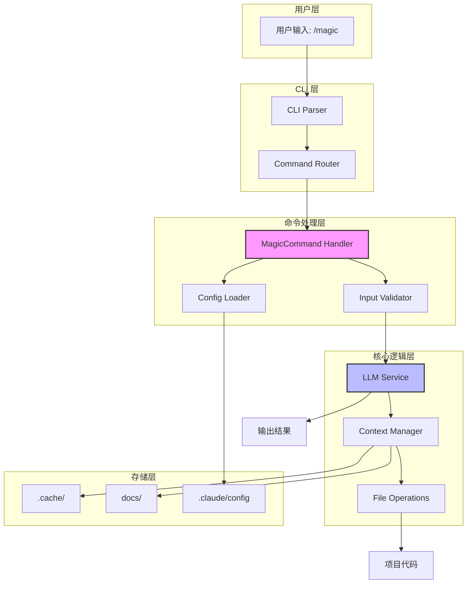
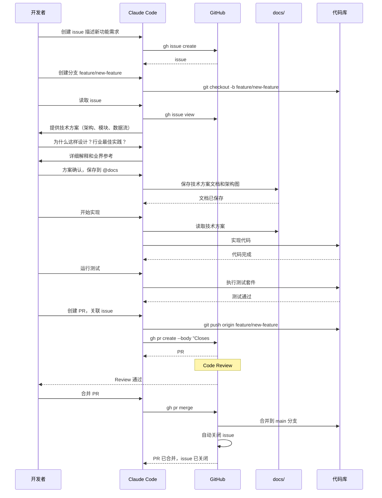

# Claude Code 最佳实践

> 先想清楚，再动手

## 核心原则

先讨论技术方案，理解所有细节，确认无误后再写代码。讨论方案 1-2 小时，写代码 10-20 分钟。方案没想清楚就动手，返工时间可能是几小时甚至几天。

**黄金法则：讨论方案的时间能省下十倍的返工时间**。

## 如何讨论技术方案

告诉 Claude Code："我想实现某功能，先讨论技术方案，不要写代码。" 然后提问：整体架构是什么？需要哪些模块？数据流如何？技术选型？可能的坑？

对任何不理解的地方都要问清楚。为什么用 Redis 而非 Memcached？中间件执行顺序为何这样安排？WebSocket 和轮询的区别？数据结构为何这样设计？必须完全理解每个决策。

讨论时询问行业最佳实践。"这个场景的行业最佳实践是什么？" "业界通常如何解决这类问题？" Claude Code 训练数据包含大量开源项目和技术文档，能提供有价值的行业经验参考。

**核心：理解每个决策，而非接受每个建议**。

## 保存技术方案

讨论完的技术方案必须记录下来。在项目根目录建 `docs` 文件夹，保存技术方案、架构设计、技术决策。告诉 Claude Code："把我们讨论的方案整理成文档，保存到 @docs 目录。"

原因：Claude Code 无法跨 session 保持上下文。复杂项目需要多个 session 完成，每次新 session 都需要重新理解技术方案。有文档，直接 @docs 让它读取；没文档，每次都要重新讨论，浪费时间。讨论过程中的架构图、数据流图、时序图都要保存，图比文字更直观。

**核心：今天的文档，明天的时间节省器**。

## 案例对比

### 购物车功能

**常规做法：**
"帮我实现购物车功能" → 写代码 → "要支持多规格" → 改代码 → "数据要存服务端" → 大改 → "要支持优惠券" → 继续改。

问题：需求不断变化，架构不断调整，代码越来越混乱。可能最后发现整体方案不合理，需要推倒重来。

**推荐做法：**
"实现购物车功能，需求：多规格商品、服务端存储、优惠券、库存检查、游客和登录用户。请给技术方案。" → 讨论方案，理解所有细节 → "保存方案到 docs，开始实现" → 一次到位，架构清晰。

### API 性能优化

**常规做法：**
"API 很慢，帮我优化" → 加缓存、加索引 → 效果不明显 → 继续尝试 → 方向不对，优化失败。

**推荐做法：**
"API 响应慢，分析原因：数据库、网络还是计算？列出优化方案，评估收益成本，给出优先级。" → 发现 N+1 查询问题 → 问清楚什么是 N+1 → 讨论 JOIN 方案 → 确定方案：JOIN + Redis → 保存到 docs → 实现 → 问题解决。

**核心：需求越完整，实现越高效**。

## 适用场景

适合：新功能开发、架构设计、性能优化、代码重构、技术选型。

不适合：简单 bug 修复、文案修改、样式调整。

判断标准：任务涉及多个模块、需要技术决策、影响系统架构，就先讨论方案。

**核心：复杂任务讨论方案，简单任务直接动手**。

## 开发流程

使用标准 GitHub 工作流。Claude Code 可以通过 `gh` 命令协助完成每个步骤。

### 需求和问题管理

使用 GitHub Issues 管理需求和 Bug：

```
"查看所有未解决的 issues"
"创建一个 issue：用户登录功能需要支持 OAuth"
"读取 issue #123 的详细内容"
"在 issue #123 添加评论说明进展"
"关闭 issue #123"
```

Claude Code 通过 `gh` 命令直接操作 issues，可以读取需求细节、更新进度、关联 PR。

### PR 工作流

1. **创建功能分支**
   ```
   "创建新分支 feature/user-authentication"
   ```

2. **讨论和实现**
   - 先讨论技术方案，保存到 docs
   - 确认方案后开始实现
   - 分阶段提交，每个提交解决一个明确的问题

3. **运行测试**
   ```
   "运行所有测试，修复失败的用例"
   ```

4. **创建 Pull Request**
   ```
   "创建 PR 到 main 分支，生成详细的 PR 描述"
   ```
   Claude Code 会根据代码变更自动生成 PR 描述，包含改动内容、测试情况等。

5. **Code Review**
   - 团队成员审查代码和技术方案文档
   - 根据反馈调整

6. **合并**
   - Review 通过后合并
   - 删除功能分支

**核心：小步快跑，持续集成**。

## 其他技巧

**画图：** 要求 Claude Code 用 Mermaid 画架构图、数据流图、时序图、ER 图。Mermaid 语法简单，渲染效果清晰美观，易于理解和维护。GitHub 和大多数 Markdown 编辑器原生支持。把图保存到 docs 目录作为技术文档。

示例请求：
```
"用 Mermaid 画出系统架构图，展示各模块间的调用关系"
"画一个用户登录的时序图，展示前端、后端、数据库的交互流程"
```

架构图示例（为 Claude Code 添加 /magic 命令）：


时序图示例（完整功能开发流程）：


**多方案对比：** "给出三种方案：最简单的、性能最优的、最灵活的。分析优缺点。" 权衡利弊后选择，把选型理由记录到 docs。

**核心：一图胜千言，多方案避险**。

## 实践要点

讨论方案时花足够时间，完全理解每个技术决策。方案整理成文档保存到 docs。确认无误后再写代码。发现问题立即停下重新讨论。

慢就是快。方案上多花时间，代码上省时间。

---

## 文档目录

`docs` 目录存放技术方案文档、架构设计、最佳实践案例。

结构：
- `docs/basics/` - 基础知识
- `docs/advanced/` - 进阶技巧
- `docs/examples/` - 实战案例
- `docs/best-practices/` - 最佳实践

## 社区

- [CC Chat 社区](https://github.com/optima-chat/cc-chat) - Claude Code 中文社区
- [GitHub Discussions](../../discussions) - 讨论交流

## 许可证

MIT
