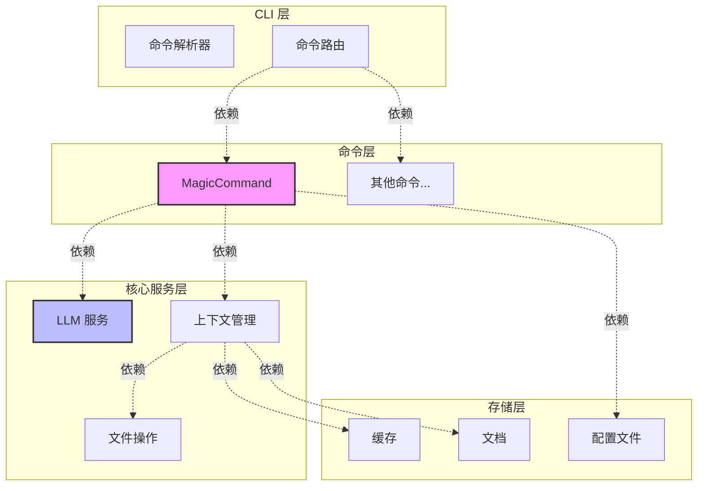
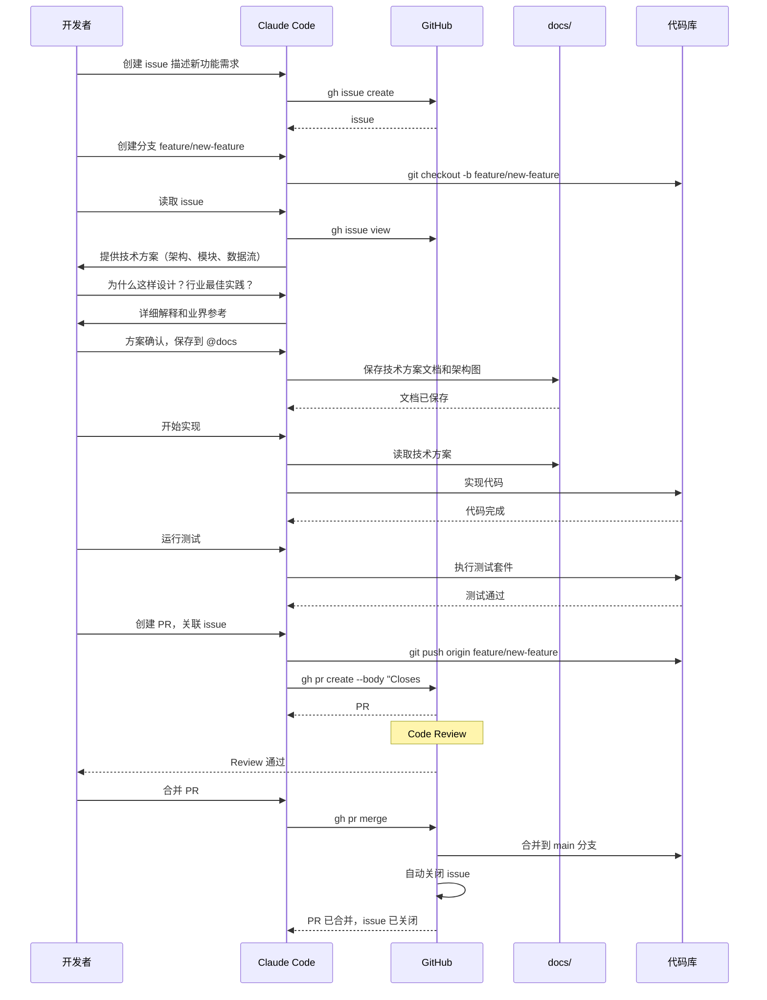

# Claude Code 最佳实践

> 先想清楚，再动手

## 核心原则

先讨论技术方案，理解所有细节，确认无误后再写代码。讨论方案 1-2 小时，写代码 10-20 分钟。方案没想清楚就动手，返工时间可能是几小时甚至几天。

**黄金法则：讨论方案的时间能省下十倍的返工时间**。

## 如何讨论技术方案

告诉 Claude Code："我想实现某功能，先讨论技术方案，不要写代码。" 然后提问：整体架构是什么？需要哪些模块？数据流如何？技术选型？可能的坑？

对任何不理解的地方都要问清楚。为什么用 Redis 而非 Memcached？中间件执行顺序为何这样安排？WebSocket 和轮询的区别？数据结构为何这样设计？必须完全理解每个决策。

**核心：充分理解技术方案，实施遇到问题时才能给出有效判断**。

## 行业最佳实践

让 Claude Code 提供多个方案和行业最佳实践对比，选择最合适的：

**询问行业经验：**
```
"这个场景的行业最佳实践是什么？"
"业界通常如何解决这类问题？"
"大厂是怎么做的？"
```

Claude Code 训练数据包含大量开源项目和技术文档，能提供有价值的行业经验参考。

**多方案对比：**
```
"给出三种方案：
1. 最简单快速能上线的
2. 性能最优的
3. 最灵活可扩展的

分析每个方案的优缺点、适用场景、实施成本。"
```

权衡利弊后选择最合适的方案，把选型理由和被否决方案的原因都记录到 docs。

**核心：多方案对比，基于业界经验决策，避免闭门造车**。

## 保存技术方案

讨论完的技术方案必须记录下来。在项目根目录建 `docs` 文件夹，保存技术方案、架构设计、技术决策。告诉 Claude Code："把我们讨论的方案整理成文档，保存到 @docs 目录。"

原因：Claude Code 无法跨 session 保持上下文。复杂项目需要多个 session 完成，每次新 session 都需要重新理解技术方案。有文档，直接 @docs 让它读取；没文档，每次都要重新讨论，浪费时间。讨论过程中的架构图、数据流图、时序图都要保存，图比文字更直观。

**核心：docs 是跨 session 的上下文，没有文档就没有记忆**。

## 案例对比

### 购物车功能

**常规做法：**
"帮我实现购物车功能" → 写代码 → "要支持多规格" → 改代码 → "数据要存服务端" → 大改 → "要支持优惠券" → 继续改。

问题：需求不断变化，架构不断调整，代码越来越混乱。可能最后发现整体方案不合理，需要推倒重来。

**推荐做法：**
"实现购物车功能，需求：多规格商品、服务端存储、优惠券、库存检查、游客和登录用户。请给技术方案。" → 讨论方案，理解所有细节 → "保存方案到 docs，开始实现" → 一次到位，架构清晰。

### API 性能优化

**常规做法：**
"API 很慢，帮我优化" → 加缓存、加索引 → 效果不明显 → 继续尝试 → 方向不对，优化失败。

**推荐做法：**
"API 响应慢，分析原因：数据库、网络还是计算？列出优化方案，评估收益成本，给出优先级。" → 发现 N+1 查询问题 → 问清楚什么是 N+1 → 讨论 JOIN 方案 → 确定方案：JOIN + Redis → 保存到 docs → 实现 → 问题解决。

**核心：需求越完整，实现越高效**。

## 开发流程

标准 GitHub 工作流，Claude Code 通过 `gh` 命令协助：

1. 创建 issue 描述需求，用 `gh issue create` 或让 CC 创建
2. 创建功能分支，讨论技术方案并保存到 docs
3. 实现代码，运行测试修复失败用例
4. 创建 PR 关联 issue（Closes #123），CC 自动生成 PR 描述
5. Code Review 通过后合并，删除分支

**核心：小步快跑，持续集成**。

## 可视化

**画图：** 要求 Claude Code 用 Mermaid 画架构图、数据流图、时序图、ER 图。Mermaid 语法简单，渲染效果清晰美观，易于理解和维护。GitHub 和大多数 Markdown 编辑器原生支持。把图保存到 docs 目录作为技术文档。

示例请求：
```
"用 Mermaid 画出系统架构图，展示各模块间的调用关系"
"画一个用户登录的时序图，展示前端、后端、数据库的交互流程"
```

架构图示例（为 Claude Code 添加 /magic 命令）：


时序图示例（完整功能开发流程）：


**核心：一图胜千言**。

## 测试驱动开发

先写测试，再写代码。让 Claude Code 帮你实践 TDD：

**TDD 流程：**
```
"根据技术方案，先写测试用例定义预期行为"
"运行测试，确认失败（红）"
"实现最小代码使测试通过（绿）"
"重构优化代码（重构）"
```

**测试覆盖：**
- 单元测试：独立函数和模块
- 集成测试：模块间协作
- 接口测试：API 端点

**自动化：**
```
"创建测试脚本，集成到 CI/CD"
"配置 GitHub Actions，测试失败禁止合并"
```

**核心：测试覆盖越全面，代码质量越有保障**。

---

## 文档目录

`docs` 目录存放技术方案文档、架构设计、最佳实践案例。

结构：
- `docs/basics/` - 基础知识
- `docs/advanced/` - 进阶技巧
- `docs/examples/` - 实战案例
- `docs/best-practices/` - 最佳实践

## 社区

- [CC Chat 社区](https://github.com/optima-chat/cc-chat) - Claude Code 中文社区
- [GitHub Discussions](../../discussions) - 讨论交流

## 许可证

MIT
